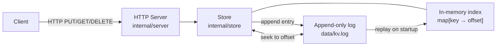

# kvstore

A single-node persistent key-value store backed by an append-only log, exposed over HTTP — built as a study in storage engine fundamentals.

## Architecture



Every write appends a newline-delimited JSON entry to the log file before acknowledging the client. Reads use an in-memory index (`map[string]int64`) that maps each key to its latest entry's byte offset — no log scan per read. On startup, the index is rebuilt by replaying the full log from byte 0.

## Why this design

This is the [Bitcask](https://riak.com/assets/bitcask-intro.pdf) model: append-only writes for predictable write latency and simple crash analysis, O(1) reads via an in-memory index. The tradeoffs accepted in V1:

- **No `fsync`**: writes are OS-buffered. Killing the process mid-write loses recent entries.
- **No checksums**: a corrupt log entry will cause a failed replay with no isolation of the bad record.
- **No compaction**: the log grows unbounded; deleted keys still take space on disk.

V2 will fix these with a WAL + fsync, entry-level CRCs, and Raft replication.

## What broke and how I fixed it

*To be filled in after the Week 3 break-it phase.*

## Build

Requires Go 1.22+.

```bash
make build          # outputs bin/kvserver
```

## Run

```bash
make run            # listens on :9090, log at data/kv.log
```

Or with custom flags:

```bash
./bin/kvserver -addr :9191 -log-file /tmp/kv.log
```

## Test

```bash
make test           # runs all tests with -race
```

To run a single package:

```bash
go test -race ./internal/store/...
go test -race ./internal/server/...
```

## Usage

```bash
# Store a value
curl -X PUT http://localhost:9090/keys/hello -d "world"

# Retrieve a value
curl http://localhost:9090/keys/hello

# Delete a key
curl -X DELETE http://localhost:9090/keys/hello

# Health check
curl http://localhost:9090/health
```

## Branch model

| Branch | Purpose |
|--------|---------|
| `main` | Stable — tests must pass before merging. Completed builds are tagged here. |
| `v<N>-<feature>` | Work branch for the next build, cut from `main` at the previous build's tag. |

Tags mark completed builds:

| Tag | Description |
|-----|-------------|
| `v1.0.0` | V1 complete — single-node KV store with append-only log |
| `v2.0.0` | V2 complete — WAL + fsync + Raft replication |

Workflow for each build:

```bash
# 1. Cut a branch from the last stable tag
git checkout -b v1-raft v1.0.0

# 2. Implement, test, document on the branch
make test

# 3. Merge to main (no-ff preserves the branch in the graph)
git switch main
git merge --no-ff v1-raft

# 4. Tag the completed build
git tag -a v2.0.0 -m "V2: WAL + Raft replication"
```

## What I'd do next

- Implement V2: `fsync` on every append, entry-level CRC, crash recovery from a truncated tail
- Add Raft replication across 3 nodes via `hashicorp/raft`
- Log compaction (merge segments, rewrite live keys only)
- Read-index queries for linearizable reads against the Raft cluster
