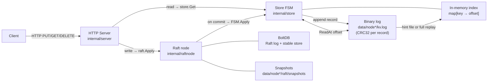

# kvstore

A distributed, fault-tolerant key-value store built as a study in storage engine and consensus fundamentals. V1 was a deliberately naive single-node implementation; V2 adds durability, compaction, and Raft replication.

## Architecture



Writes go through `raft.Apply` and are committed only after a quorum of nodes acknowledges them. The FSM calls `store.Put`/`store.Delete` once the entry is committed. Reads go directly to the local store (potentially stale on followers); `?consistent=true` calls `raft.Barrier()` first for linearizable reads.

Non-leader nodes return `307 Temporary Redirect` pointing at the current leader's HTTP address. Clients following redirects automatically route writes to the leader.

The storage engine is the [Bitcask](https://riak.com/assets/bitcask-intro.pdf) model: append-only writes for predictable latency, O(1) reads via an in-memory index. On startup the index is rebuilt from a hint file (O(live keys)) if one exists, otherwise by replaying the full log.

## Why this design

**Raft for consensus** — simpler to reason about than Paxos; the [`hashicorp/raft`](https://github.com/hashicorp/raft) library provides a production-grade implementation that is widely used (Consul, Nomad, etcd-adjacent tooling).

**BoltDB-backed log/stable store** — the Raft log (and stable store for term/vote metadata) lives in BoltDB, separate from the KV data file. This separation keeps the KV log compact and compaction-friendly without disturbing Raft's own bookkeeping.

**Node ID = HTTP address** — storing the HTTP address as the Raft `ServerID` allows any node to read the leader's HTTP address directly from `raft.LeaderWithID()` and include it in a redirect response, without a separate discovery mechanism.

## V1 weaknesses — documented in `store_failures_test.go`

| Failure | Test |
|---------|------|
| No `fsync` → torn write = lost key after restart | `TestDataLossOnTruncatedWrite` |
| No checksums → corrupt entry vanishes silently | `TestCorruptEntryDroppedSilently` |
| No compaction → log grows unbounded | `TestLogGrowsUnbounded` |
| Tombstones never reclaimed | `TestDeleteDoesNotReclaimDisk` |
| Replay is O(write history), not O(live keys) | `TestReplayScansFullLogHistory` |

## V2 fixes

| Step | Fix | Status |
|------|-----|--------|
| 0 | Binary log format + CRC32 per record | ✓ done |
| 1 | WAL + `fsync` + crash recovery | ✓ done |
| 2 | Atomic log compaction | ✓ done |
| 3 | Hint file for O(live-keys) startup | ✓ done |
| 4 | Raft replication across 3 nodes | ✓ done |
| 5 | Linearizable reads via `?consistent=true` | ✓ done |

## What broke and how I fixed it

- **Truncated write**: killing the process mid-write left a partial record in the log. V1 silently skipped it — data loss with no error. V2 detects the torn tail via CRC mismatch and truncates to the last good record; the store opens cleanly.
- **Log growth**: 100 overwrites of the same key produced 4 900 bytes on disk (V1 JSON) / 2 400 bytes (V2 binary) for a single live key. V2 compaction rewrites only live keys atomically; `kvdump` stale% drops to 0.
- **Silent corruption**: a flipped byte in a middle record was skipped by V1's JSON parser with no error. V2's CRC check returns `ErrCorrupt` from `Open()`.
- **Replay cost**: 10 000 stale entries took ~25 ms to replay. After compaction produces a hint file, the same store reopens in ~54 µs — a 460× improvement.
- **Single point of failure**: V1 had no replication. V2 uses `hashicorp/raft` with a 3-node cluster; the leader can fail and a new one is elected within the heartbeat timeout. Writes are linearizable.

## Build

Requires Go 1.22+.

```bash
make build          # outputs bin/kvserver and bin/kvdump
```

## Run

**Single node** (single-voter cluster, immediately becomes leader):

```bash
make run            # listens on :9090, data in data/node1/
```

**Three-node cluster** (nodes started in background):

```bash
make run-cluster    # nodes on :9091, :9092, :9093
make stop-cluster
```

**Custom flags:**

```bash
./bin/kvserver \
  -node-id  http://myhost:9091 \
  -http-addr :9091 \
  -raft-addr myhost:7001 \
  -data-dir  /var/lib/kvstore/node1 \
  -peers    "http://myhost:9091=myhost:7001,http://myhost:9092=myhost:7002,http://myhost:9093=myhost:7003"
```

| Flag | Default | Description |
|------|---------|-------------|
| `-node-id` | `http://localhost:9090` | This node's HTTP address; stored as Raft ServerID for leader redirects |
| `-http-addr` | `:9090` | HTTP listen address |
| `-raft-addr` | `localhost:7000` | Raft TCP bind address |
| `-data-dir` | `data` | Directory for Raft state (BoltDB, snapshots) and KV log |
| `-peers` | *(single-node)* | Comma-separated `nodeID=raftAddr` pairs for all cluster members |
| `-compact-mb` | `32` | Compaction threshold in MB; log is rewritten when data file exceeds this size |

## Test

```bash
make test                              # all packages with -race
go test -race -count=1 ./internal/store/...     # storage engine only
go test -race -count=1 ./internal/raftnode/...  # Raft integration
go test -race -count=1 ./internal/server/...    # HTTP handlers
```

## Diagnostics

`kvdump` decodes and prints every record in a binary log file.

```bash
./bin/kvdump -log data/node1/kv.log
```

Example output:

```
offset=0             PUT  key="session:abc"            52 bytes  value="hello world"
offset=52       STALE PUT  key="session:abc"            52 bytes  value="old value"
offset=104           DEL  key="session:abc"             24 bytes

live keys: 0  |  records: 3  |  file: 128 bytes  |  stale: 128 bytes (100%)
```

## Usage

```bash
# Store a value (routes to leader automatically via redirect)
curl -L -X PUT http://localhost:9091/keys/hello -d "world"

# Retrieve a value (potentially stale local read — fast)
curl http://localhost:9091/keys/hello

# Linearizable read — calls raft.Barrier() before reading, guarantees no stale data
# (follows a 307 to the leader when the node you hit is a follower — Barrier is leader-only)
curl -L "http://localhost:9091/keys/hello?consistent=true"

# Delete a key
curl -L -X DELETE http://localhost:9091/keys/hello

# Check node status (shows Raft leader info)
curl http://localhost:9091/health
```

The `-L` flag tells curl to follow the `307` redirect if the node you hit is not the leader.

## Branch model

| Branch | Purpose |
|--------|---------|
| `main` | Stable — tests must pass before merging. Completed builds are tagged here. |
| `v<N>-<feature>` | Work branch for the next build, cut from `main` at the previous build's tag. |

Tags mark completed builds:

| Tag | Description |
|-----|-------------|
| `v1.0.0` | V1 complete — single-node KV store with append-only log (JSON-lines) |
| `v2.0.0` | V2 complete — WAL + fsync + compaction + hint file + Raft replication |

## What I'd do next

- **Membership changes**: use `raft.AddVoter`/`raft.RemoveServer` to add and remove nodes without restarting the cluster
- **Jepsen-lite test**: run a partition/kill scenario and verify linearizability with a checker like Knossos
