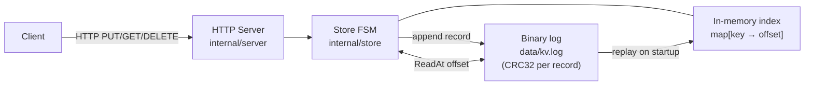

# kvstore

A distributed, fault-tolerant key-value store built as a study in storage engine and consensus fundamentals. V1 was a deliberately naive single-node implementation; V2 (in progress on branch `v1-raft`) adds durability, compaction, and Raft replication.

## Architecture



Every write appends a length-prefixed binary record with a CRC32 checksum before acknowledging the client. Reads use an in-memory index (`map[string]int64`) that maps each key to the byte offset of its latest record — no log scan per read. On startup the index is rebuilt from a hint file (O(live keys)) if one exists, otherwise by replaying the full log from byte 0.

## Why this design

This is the [Bitcask](https://riak.com/assets/bitcask-intro.pdf) model: append-only writes for predictable latency, O(1) reads via an in-memory index.

**V1 weaknesses — documented in `store_failures_test.go`:**

| Failure | Test |
|---------|------|
| No `fsync` → torn write = lost key after restart | `TestDataLossOnTruncatedWrite` |
| No checksums → corrupt entry vanishes silently | `TestCorruptEntryDroppedSilently` |
| No compaction → log grows unbounded | `TestLogGrowsUnbounded` |
| Tombstones never reclaimed | `TestDeleteDoesNotReclaimDisk` |
| Replay is O(write history), not O(live keys) | `TestReplayScansFullLogHistory` |

**V2 fixes (branch `v1-raft`, see `v2-plan.md`):**

| Step | Fix | Status |
|------|-----|--------|
| 0 | Binary log format + CRC32 per record | ✓ done |
| 1 | WAL + `fsync` + crash recovery | in progress |
| 2 | Atomic log compaction | pending |
| 3 | Hint file for O(live-keys) startup | pending |
| 4 | Raft replication across 3 nodes | pending |

## What broke and how I fixed it

V1 was instrumented with six deliberate failure tests. Running `go test -v ./internal/store/...` after each break-it scenario produced:

- **Truncated write**: killing the process mid-write left a partial record in the log. On restart, `replay()` silently skipped it — the key was gone with no error to the operator.
- **Log growth**: 100 overwrites of the same key produced 4 900 bytes on disk (V1 JSON) / 2 400 bytes (V2 binary) for a single live key. Disk usage grows linearly with write count, not key count.
- **Silent corruption**: a flipped byte in a middle record was skipped by V1's JSON parser with no error. V2's CRC check returns `ErrCorrupt` from `Open()`.
- **Replay cost**: 10 000 stale entries took ~50 ms to replay in V1, ~18 ms in V2 (binary decode is faster than JSON; hint file will eliminate this entirely).

The V2 binary format (Step 0) addressed checksums and reduced log size by ~57%. Steps 1–3 complete local durability. Step 4 adds fault tolerance.

## Build

Requires Go 1.22+.

```bash
make build          # outputs bin/kvserver and bin/kvdump
```

## Run

```bash
make run            # listens on :9090, log at data/kv.log
```

Or with custom flags:

```bash
./bin/kvserver -addr :9191 -log-file /tmp/kv.log
```

## Test

```bash
make test           # runs all tests with -race
```

To run a single package:

```bash
go test -race ./internal/store/...
go test -race ./internal/server/...
```

## Diagnostics

`kvdump` decodes and prints every record in a binary log file. Use it to inspect data, verify writes, and measure compaction effectiveness.

```bash
./bin/kvdump -log data/kv.log
```

Example output:

```
offset=0             PUT  key="session:abc"            52 bytes  value="hello world"
offset=52       STALE PUT  key="session:abc"            52 bytes  value="old value"
offset=104           DEL  key="session:abc"             24 bytes

live keys: 0  |  records: 3  |  file: 128 bytes  |  stale: 128 bytes (100%)
```

Records marked `STALE` would be removed by compaction. The summary line shows how much space a compaction would reclaim.

## Usage

```bash
# Store a value
curl -X PUT http://localhost:9090/keys/hello -d "world"

# Retrieve a value
curl http://localhost:9090/keys/hello

# Delete a key
curl -X DELETE http://localhost:9090/keys/hello

# Health check
curl http://localhost:9090/health
```

## Branch model

| Branch | Purpose |
|--------|---------|
| `main` | Stable — tests must pass before merging. Completed builds are tagged here. |
| `v<N>-<feature>` | Work branch for the next build, cut from `main` at the previous build's tag. |

Tags mark completed builds:

| Tag | Description |
|-----|-------------|
| `v1.0.0` | V1 complete — single-node KV store with append-only log (JSON-lines) |
| `v2.0.0` | V2 complete — WAL + fsync + Raft replication *(pending)* |

Workflow for each build:

```bash
# 1. Cut a branch from the last stable tag
git checkout -b v1-raft v1.0.0

# 2. Implement, test, document on the branch
make test

# 3. Merge to main (no-ff preserves the branch in the graph)
git switch main
git merge --no-ff v1-raft

# 4. Tag the completed build
git tag -a v2.0.0 -m "V2: WAL + Raft replication"
```

## What I'd do next

- **Step 1**: WAL + `fsync` after every write; truncate torn tail on replay (`TestDataLossOnTruncatedWrite` should now fail)
- **Step 2**: Atomic log compaction — `kvdump` stale% drops to 0 after compact
- **Step 3**: Hint file — `TestReplayScansFullLogHistory` replay time drops to sub-millisecond
- **Step 4**: Raft replication via `hashicorp/raft` — 3-node cluster, leader election, linearizable writes
